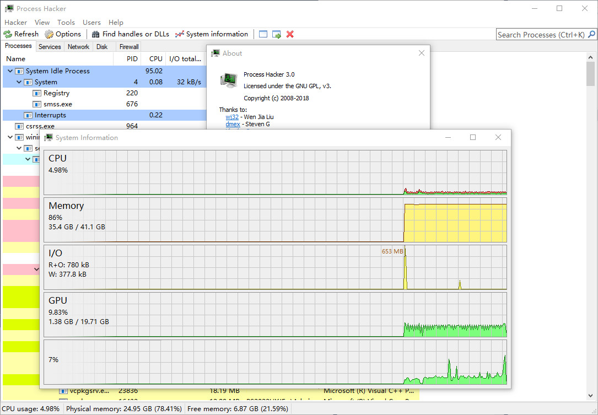

## Study Only

VS2017 is OK!

Process Hacker 3.0 + Full plugin

## Process Hacker

A free, powerful, multi-purpose tool that helps you monitor system resources, debug software and detect malware.

* [Official Website](https://processhacker.sourceforge.io/)
* [Nightly Builds](https://wj32.org/processhacker/nightly.php)

## System requirements

Windows 7 or higher, 32-bit or 64-bit.

## Building the project

Requires Visual Studio (2017 or later).

### Process Hacker 3.0 Src

[Process Hacker](https://github.com/PKRoma/ProcessHacker/tree/9e0da12eb362e6061d1d6350eceae8f3711775a0)

[plugins-extra](https://github.com/processhacker/plugins-extra/commit/b57408bc607411d9331da7f6d3daa6c55fd764fc)

##### SnapShot

